# CUDA Path Tracer

**University of Pennsylvania, CIS 5650: GPU Programming and Architecture, Project 3 - CUDA Path Tracer**

- Faris Rafie Syahzani
- Tested on: Windows 11, AMD Ryzen 7 8845HS, NVIDIA GeForce RTX 4050 Laptop GPU (6 GB), 16 GB RAM

## Bunny Observatory

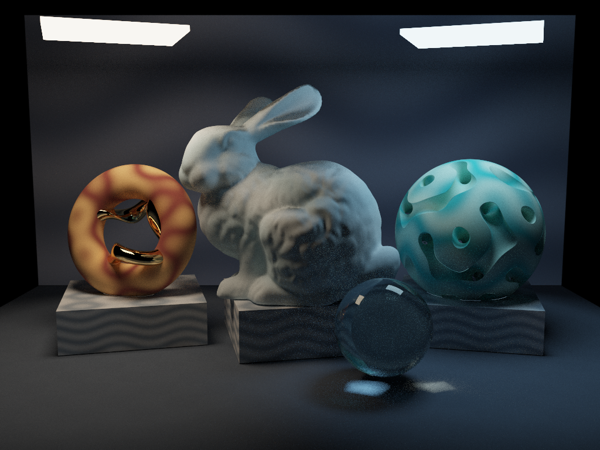

A small gallery of geometry, glass, and warm/cool light. The Stanford Bunny sits between a procedurally woven ring and a gyroid shell, on marble plinths above a checker floor. The renderer combines diffuse global illumination, ideal reflection and transmission, a thin-lens camera, explicit area-light sampling, and GPU mesh traversal.

**Cover:** 1024 × 768, 1,024 samples per pixel (spp), at most 10 bounces; **82.205 s** for the headless render loop on an RTX 4050 Laptop GPU. This wall time includes per-sample host transfers but excludes initialization and final image encoding. This is an actual render, without denoising. Use the [full scene](scenes/bunny_observatory.json) or [quick preview](scenes/bunny_observatory_preview.json).

## Render it

From the repository root in PowerShell, with an existing build:

```powershell
cmake --build build/verify --config Release --parallel 4
.\build\verify\bin\Release\cis565_path_tracer.exe scenes/bunny_observatory_preview.json --headless --output img/local/bunny
```

For a fresh Visual Studio 2022 build, install its C++ desktop tools and a compatible CUDA toolkit, then configure once:

```powershell
cmake -S . -B build/verify -G "Visual Studio 17 2022" -A x64
cmake --build build/verify --config Release --parallel 4
```

Open the generated solution if you prefer Visual Studio, select **Release / x64**, and use `cis565_path_tracer` as the startup project. Set **Debugging → Working Directory** to the repository root and **Command Arguments** to `scenes/bunny_observatory_preview.json --headless`. Building compiles the executable; running it generates the images. Rebuilding existing code does not require a separate manual CMake configuration each time.

The preview is 512 × 384 at 128 spp. For the cover, use `scenes/bunny_observatory.json`. Headless mode automatically saves PNG and HDR at completion, printing their filenames. `--output img/local/bunny` produces `img/local/bunny.<UTC timestamp>.<spp>samp.png` and `.hdr`; otherwise, the scene's `Camera.FILE` supplies the prefix, relative to the working directory.

Omit `--headless` for an interactive preview. **S** saves, **Esc** saves and exits, **Space** re-centers; left drag orbits, right drag zooms, and middle drag pans. GUI toggles control sorting, compaction, BVH traversal, antialiasing, direct lighting, and roulette. Changing a toggle restarts accumulation. On hybrid laptops, CUDA/OpenGL sharing can fail when OpenGL uses the integrated GPU; headless mode avoids that dependency. The interactive path was not validated on this laptop because of that GPU mismatch.

PNG output applies `radiance / (1 + radiance)` followed by gamma 1/2.2. HDR retains linear RGB in Radiance RGBE encoding. Comparison figures use the same PNG transform; quantitative errors use decoded linear HDR values.

## Renderer at a glance

| Capability | Implementation and control |
| --- | --- |
| Diffuse and ideal specular BSDFs | Cosine-weighted diffuse scattering; perfect mirror reflection |
| Material grouping | Thrust sorts zipped paths/hits by BSDF type; `--sort on\|off` |
| Stream compaction | Thrust removes terminated paths after gathering; `--compact on\|off` |
| Stochastic antialiasing | Independent subpixel jitter; `--aa on\|off` |
| Dielectric glass | Snell transmission, Schlick Fresnel selection, total internal reflection |
| Depth of field | Uniform disk aperture and shared focal plane; `--aperture R` |
| Procedural geometry | Gyroid shell, three-lobed woven ring, and basic torus |
| Procedural textures | Object-space checker and warped sinusoidal marble |
| Direct lighting | One random light-surface point and visibility ray per diffuse hit; `--direct-light on\|off` |
| Russian roulette | Throughput-based termination from bounce 3; `--rr on\|off` |
| OBJ meshes and mesh BVHs | Original loader, smooth normals, CPU construction, iterative GPU traversal; `--bvh on\|off` |
| Analysis/output | Headless timings, per-bounce survivors, sample checkpoints, PNG/HDR |

Each bounce performs intersection → optional material sort → shading → contribution gathering → optional compaction. Seeds include the sample, original pixel index, and depth, so moving a path does not change its sampling sequence. Each path gathers its terminal contribution once, including when compaction is disabled.

## Measurement setup

| Item | Configuration |
| --- | --- |
| GPU | NVIDIA GeForce RTX 4050 Laptop GPU, 6 GB, compute capability 8.9 |
| CPU / memory | AMD Ryzen 7 8845HS; approximately 16 GB installed RAM (15.29 GiB OS-usable) |
| Software | Windows 11 build 26200; NVIDIA driver 616.56; CUDA 13.3.73; Visual Studio 2022 |
| Build | Release, native GPU architecture, line information enabled, no device-debug `-G` |
| Trials | Five separate processes per variant; shuffled order; default laptop clocks; one GPU workload at a time |
| Samples | 36 per trial, or 16 for meshes; first four discarded |
| Aggregation | Mean remaining sample time per process, then median of the five means |
| Whiskers | Min/max process means, **not** confidence intervals |

The primary measurement is one CUDA-event interval around a complete sample. It includes GPU work **and host launch/synchronization gaps** inside the interval, with the existing stage error checks retained. It excludes scene/BVH construction, the subsequent host image copy, and PNG/HDR encoding. It is not an exclusive sum of kernel durations. Stage-event/count runs are separate and never pooled into primary timing trials. [CUDA timing guidance](https://docs.nvidia.com/cuda/cuda-c-best-practices-guide/index.html#timing).

Figures and the [results summary](analysis/data/summary.json) are included. The summary records process means, scene/flag configurations, hardware, source/executable hashes, survivor curves, and image errors. Raw CSVs, profiler captures, HDR intermediates, and local Python helpers are intentionally ignored. Results are specific to this machine, scenes, resolution, and driver; small overlapping differences are inconclusive.

## Material sorting: coherence has a price

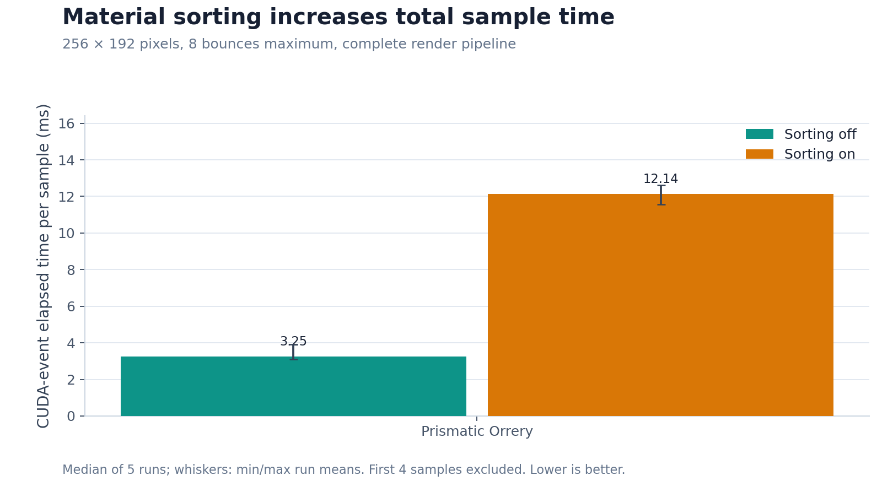

On the 256 × 192 Prismatic Orrery, sorting changes median sample time from **3.254 to 12.141 ms**, a **3.73× increase**. Keys group emission, glass, mirror, diffuse, and misses by behavior; materials with the same BSDF share a key. Paths and intersections sort together. This improves shading coherence but moves substantial data and launches Thrust/CUB work at every bounce.

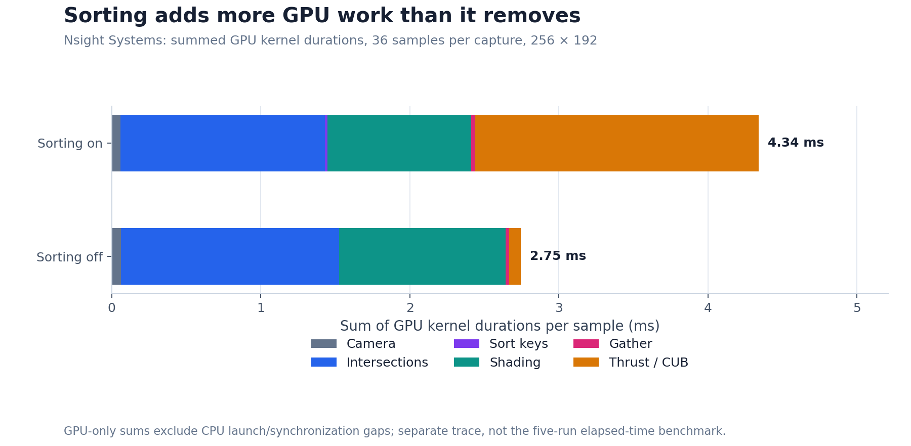

An independent Nsight Systems trace of 36 samples shows shading kernel duration decreasing from **1.116 to 0.965 ms/sample** (about 13.6%), while Thrust/CUB duration grows from **0.078 to 1.902 ms/sample**. That category includes compaction as well as sorting. GPU kernel sums are **2.745 vs 4.341 ms/sample**. These are one trace per setting, include the first samples, and omit host gaps; use the five-run chart for elapsed-time comparisons. Increased GPU work and launch/synchronization overhead outweigh the shading improvement.

<details>
<summary>Separate instrumented stage breakdown</summary>

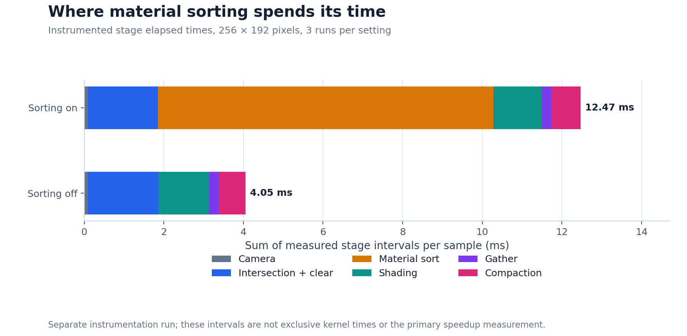

Three instrumented runs per setting, excluding their first four samples. These intervals add measurement overhead and include host gaps; totals differ from both exclusive kernel sums and primary timing trials.

</details>

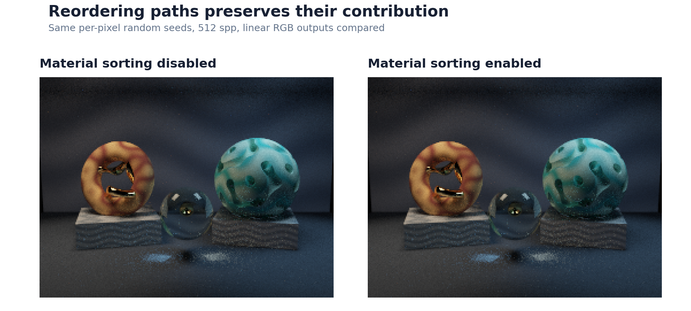

Decoded RGBE outputs match exactly here (maximum difference 0). This checks saved outputs at RGBE precision, not bitwise equality of internal floats. These results support disabling sorting for this workload, and motivate a future size/material-diversity threshold or separate material queues.

## Compaction: the room determines the opportunity

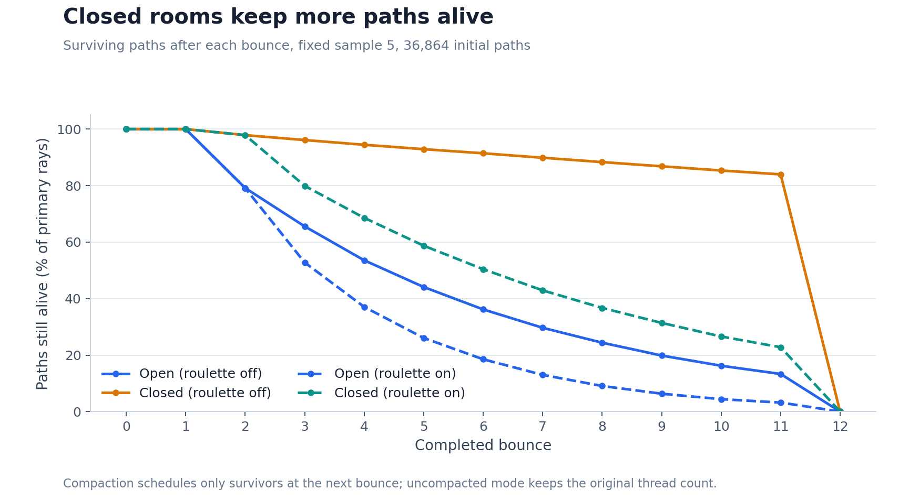

The [open](scenes/analysis/open.json) and [closed](scenes/analysis/closed.json) scenes share camera, materials, and geometry except for one added front wall. Without roulette, bounce 11 retains **4,907 / 36,864 paths (13.3%)** in the open scene and **30,958 (84.0%)** in the closed scene. All curves reach zero at bounce 12 because of the depth limit, not because every ray naturally escaped.

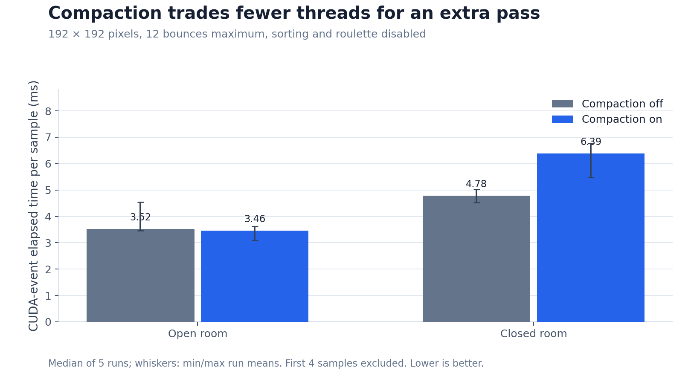

With sorting and roulette disabled, open-room medians are **3.521 ms without compaction vs 3.457 ms with it**; ranges overlap, so this is not a reliable speedup. Closed-room medians are **4.783 vs 6.388 ms**, making compaction **1.34× slower**. Many rays remain alive, and removal/movement costs more than guarded dead threads. Without compaction, kernels retain the original thread count and immediately skip dead paths. Saved RGBE outputs match exactly in the separate Orrery comparison.

Compaction reduces scheduled work only after paths terminate. This uses Thrust rather than a custom shared-memory scan. A future fused gather/partition pass and survivor-based enable threshold could reduce overhead.

## Mesh loading and iterative BVH traversal

The Bunny is a downloaded **3D model**, rendered under this project's camera, materials, and lights. The original OBJ loader accepts positions, normals, positive/negative indices, and common slash notation. It handles triangles and convex polygons through fan triangulation. Missing normals use face normals; degenerate triangles are skipped. Mesh paths resolve relative to the scene JSON. One scene material is assigned per mesh; MTL, UV textures, glTF, and concave-polygon triangulation are not implemented.

Each mesh receives an object-space binary BVH, built on the CPU by median centroid splits along the widest axis. Leaves normally hold at most four triangles; degenerate centroid distributions become a leaf. Preorder nodes store escape links for **stackless, iterative GPU traversal**. Slab tests reject bounds, nearest-hit distance prunes traversal, and triangles use a Möller–Trumbore test with interpolated normals. Ray directions stay unnormalized after inverse transformation, preserving world-space ray parameters under scaling. Both continuation and shadow rays use the toggleable BVH.

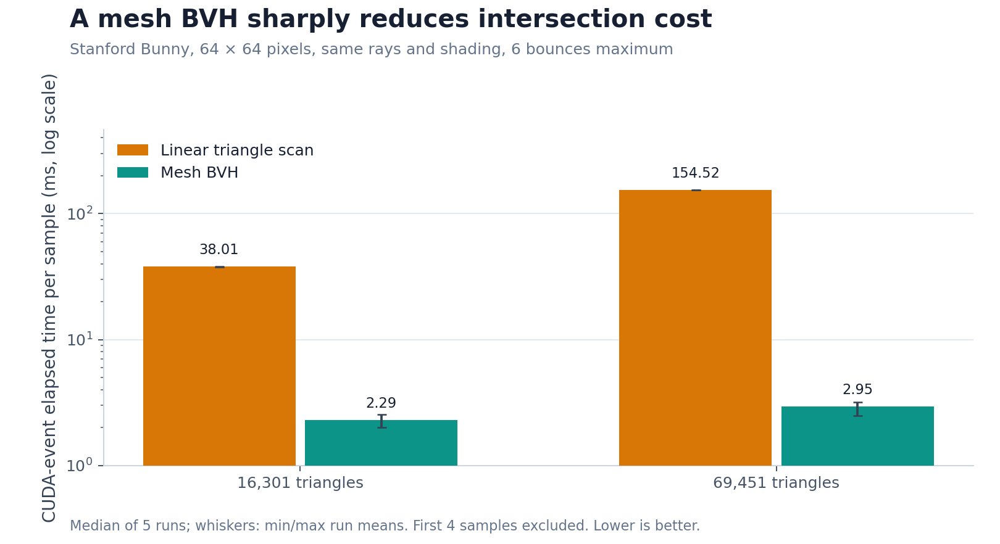

| Mesh | Linear scan (ms/sample) | BVH (ms/sample) | Elapsed-time speedup |
| --- | ---: | ---: | ---: |
| 16,301 triangles | 38.007 | 2.292 | **16.58×** |
| 69,451 triangles | 154.524 | 2.946 | **52.45×** |

Both variants use 64 × 64 pixels, 16 spp per timing trial, six-bounce maximum, and sorting off. `--bvh off` scans **every triangle**, bypassing all mesh bounds. CPU construction and GPU allocation precede timing. These compare two GPU algorithms, not GPU versus CPU, and should not be extrapolated directly to the cover.

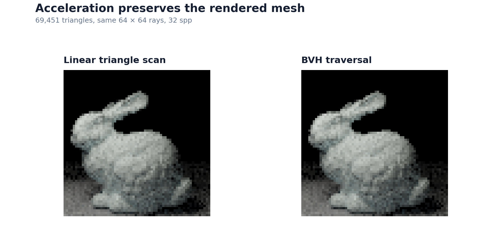

The full-mesh comparison uses identical rays at 32 spp; decoded RGBE outputs match exactly. A scene-level hierarchy, SAH construction, configurable leaf sizes, and near-first traversal are future improvements. Analytic/procedural objects still use a linear scene-object loop.

## Glass and depth of field

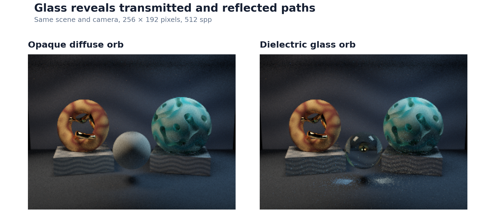

Glass chooses Schlick reflection or Snell transmission probabilistically and handles total internal reflection. Transmission applies the radiance `eta²` factor; material color tints throughput. Specular paths retain emitter hits. The sphere reveals displaced background detail and reflected lights; replacing it with diffuse material removes those paths. Orrery medians change from **11.781 ms opaque to 12.141 ms glass (1.03×)**. This includes changed trajectories/path lengths, not just arithmetic cost. Ideal glass has no rough transmission, absorption, or nested-medium tracking.

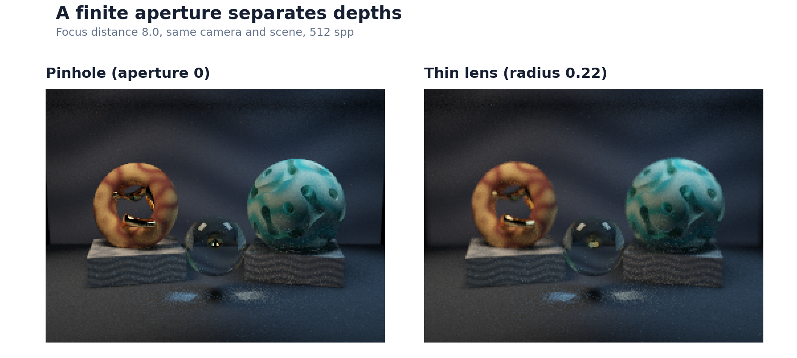

The lens samples a disk with radius proportional to `sqrt(u)`, offsets the ray origin, and aims toward the original ray's intersection with a forward-axis focal plane. The comparison uses aperture radius **0 vs 0.22**, focus distance **8.0**. Out-of-focus geometry softens while the focal region stays sharp. Medians are **12.191 vs 11.764 ms**; overlapping ranges do not establish a lens speedup. Extra sampling also changes visible geometry. A focus picker and stratified lens samples could improve usability/convergence.

## Procedural geometry and textures

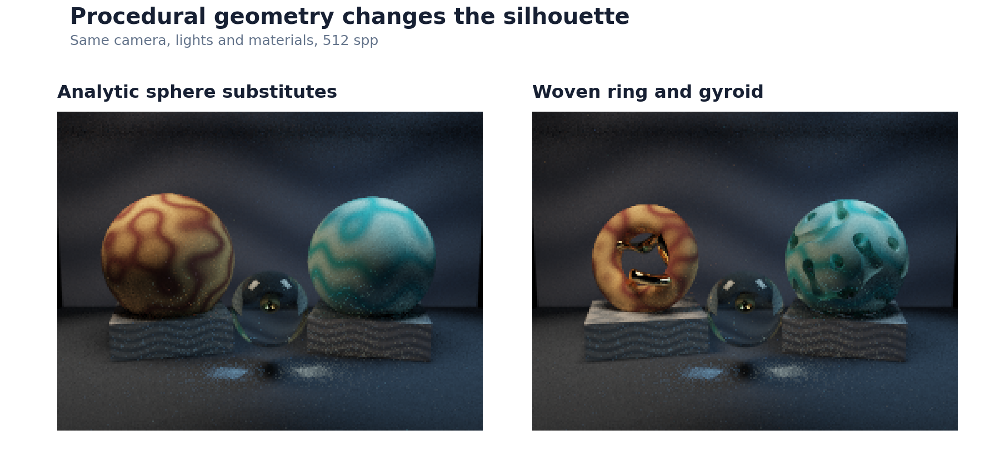

Two complex shapes need no mesh files: a **three-lobed woven ring**, whose centerline varies radially/vertically around the circle, and a **clipped periodic gyroid shell**. A basic torus is also available. Object-space bounding spheres reject misses before a conservative march of at most 160 steps; finite differences produce normals transformed by the inverse transpose. Approximate fields and finite tolerances can miss fine features; these are not exact analytic intersections. Sphere substitutes reduce median time from **12.141 to 10.480 ms**, a **1.16×** ratio, while changing silhouettes, visibility, and ray paths.

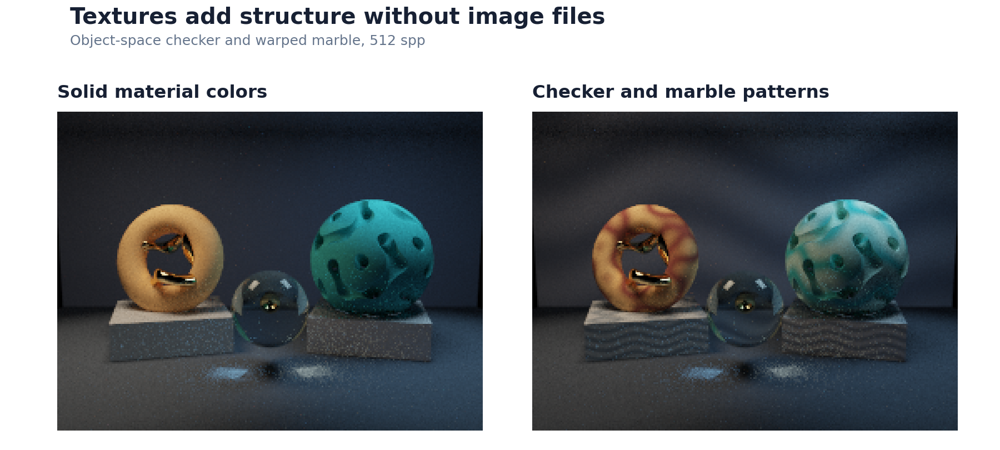

Checker uses object-space cell parity. Marble blends two colors along nested sinusoidal bands; it loads no image and uses no noise library. Texture evaluation modifies albedo for both BSDF and direct lighting. Solid/textured medians are **12.192 and 12.141 ms** with overlapping ranges: this cannot resolve a texture cost. Patterns also affect roulette probabilities. Analytic gradients, tighter shape bounds, and filtered texture frequencies are future improvements.

## Area-light sampling: quality versus shadow-ray work

At each diffuse hit, one supported emitter is selected uniformly, its surface sampled in area measure, and diffuse BRDF × geometry / PDF evaluated with visibility. Cube faces are weighted by transformed area; spheres include a transformed surface Jacobian. Diffuse BSDF hits on explicitly sampled cube/sphere emitters suppress duplicate emission; primary/specular hits keep it. This estimator has no multiple importance sampling (MIS). Mesh/procedural emitters can be hit by paths but are not explicitly sampled. Transparent objects block visibility rays.

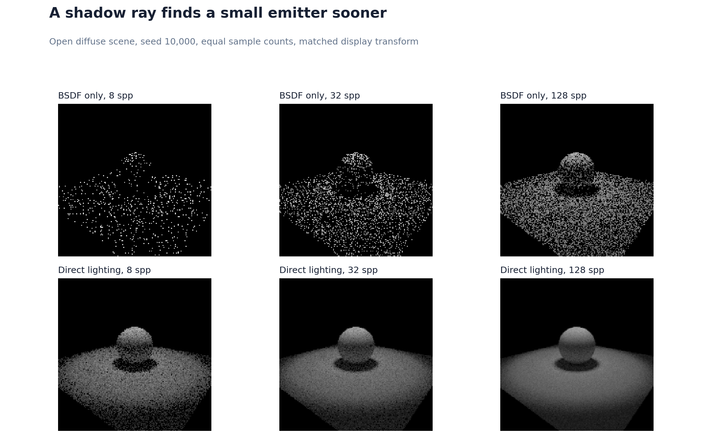

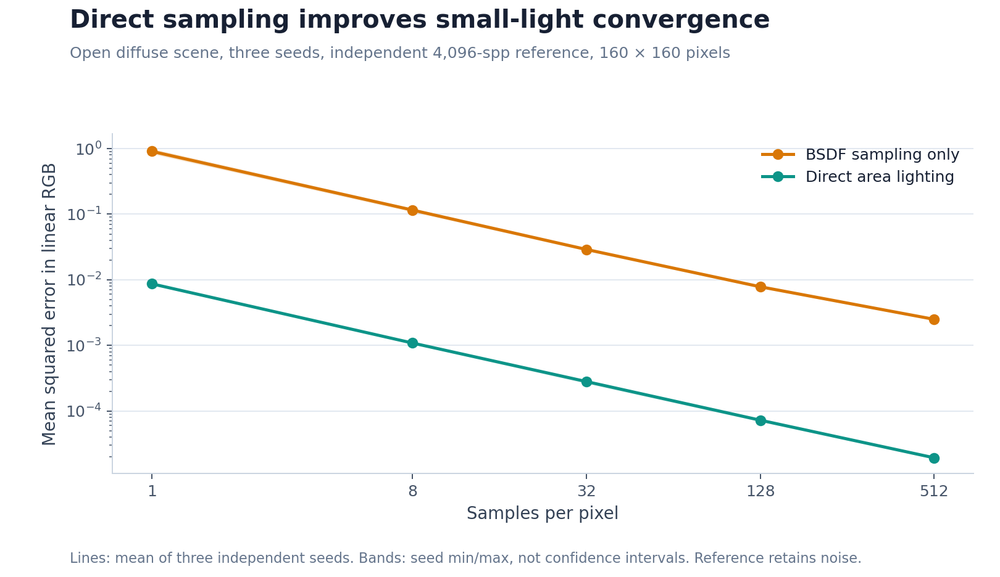

The controlled [open diffuse scene](scenes/analysis/lighting_diffuse.json) contains a distant small emitter, sphere, and floor. Three independent seeds are compared with a separate **4,096-spp** direct-light reference. At 128 spp, mean linear RGB MSE is **0.007827 without direct sampling vs 0.00007232 with it**, about **108× lower error**. This is an equal-sample **error ratio**, not a runtime speedup or universal variance claim. Bands show the seed range; the finite reference retains noise.

On the more complex Orrery, direct lighting costs **12.141 vs 10.357 ms/sample (1.17×)** because of shadow intersections and sampling. Mesh BVHs accelerate visibility, but all scene objects are still visited. Importance-weighted light selection, solid-angle sampling, and MIS are next opportunities. A hard depth limit truncates transport; direct estimation at the final diffuse vertex and BSDF-only emission paths can also differ at that boundary.

<details>
<summary>Outtake: direct sampling is not automatically better everywhere</summary>

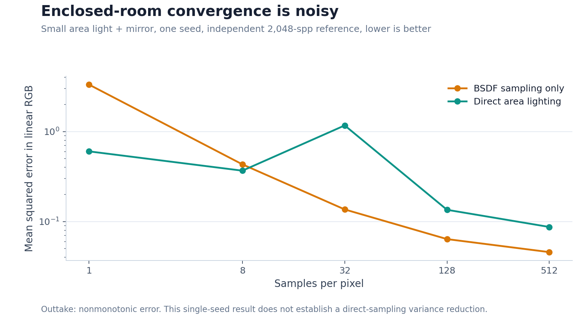

The initial enclosed room with a mirror sphere did **not** show a consistent benefit. One seed produced a large error spike at 32 spp. Close surfaces, area-to-solid-angle weights, visibility discontinuities, and specular paths are possible contributors; this experiment does not isolate their causes. A later diffuse-only enclosure also remained noisy. The open-scene experiment above deliberately isolates a distant emitter. These observations motivate MIS rather than claiming one estimator wins everywhere.

</details>

## Russian roulette: stop weak paths, reweight survivors

From bounce 3, survival probability is `clamp(max(throughput RGB), 0.05, 0.95)`. Terminated paths contribute zero continuation; surviving throughput is divided by that probability. This preserves conditional expected continuation; finite-depth truncation remains separate. The survivor plot shows the enclosed-scene opportunity: **8,398 paths** survive bounce 11 versus **30,958** without roulette.

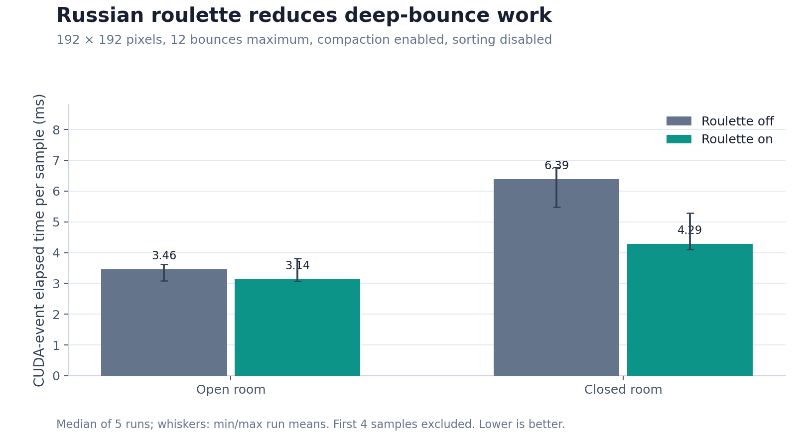

With compaction on and sorting off, roulette changes open-room median from **3.457 to 3.139 ms (1.10×)** and closed-room median from **6.388 to 4.285 ms (1.49×)**. Fewer deep rays reduce intersections and shadow work. These are equal-sample timing ratios, not equal-quality time.

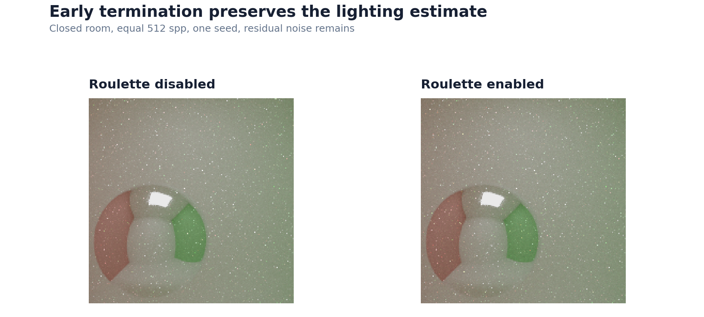

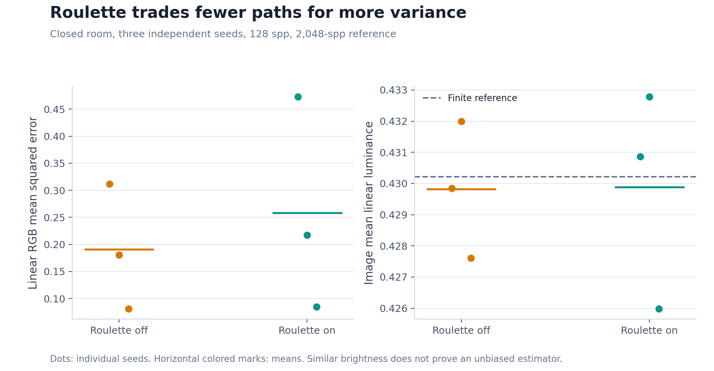

At 128 spp over three seeds, mean MSE rises from **0.1913 to 0.2584**, while mean image luminance stays close: **0.42982 vs 0.42988**, with the finite 2,048-spp reference at **0.43021**. This illustrates a variance/work tradeoff, not a proof of unbiasedness. Better probability selection should account for transmission scaling and equal-quality convergence.

## Antialiasing and visual-feature cost

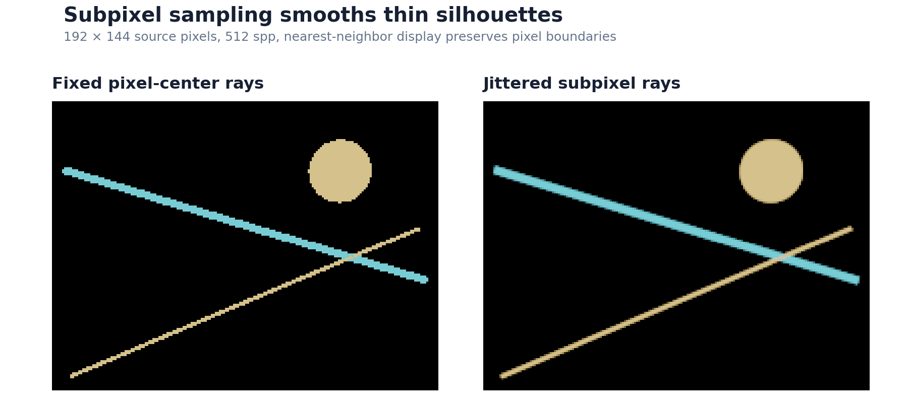

Camera rays jitter independently within their pixels. Disabling AA fixes the location at the center; draws are still consumed to keep downstream RNG comparisons reproducible. Thin silhouettes expose staircase edges. Orrery medians are **11.300 ms with fixed centers vs 12.141 ms with jitter**; different intersections contribute to the ratio. Stratified or low-discrepancy pixel/lens samples could improve low-spp quality.

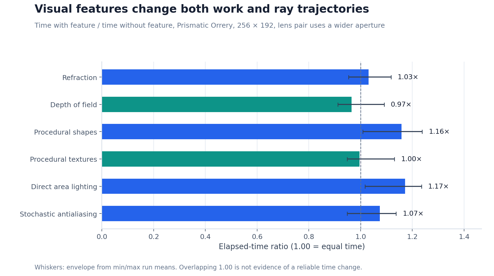

Feature comparisons isolate the listed switch, but visual switches change the workload as well as code cost. All pairs use equal resolution/sample counts. Envelopes crossing 1.00 cannot resolve a consistent cost change.

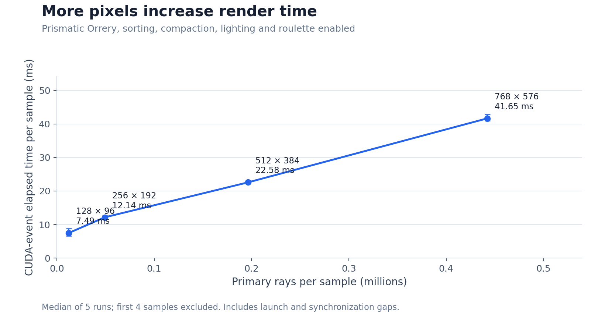

Orrery medians grow from **7.487 ms at 128 × 96** to **41.653 ms at 768 × 576**. Fixed launch/sort overhead makes time non-proportional to pixels. Sorting is enabled here; this is not a prediction for BVH-heavy or unsorted scenes.

## GPU versus a hypothetical CPU implementation

No CPU renderer was benchmarked. These are expected execution differences, not measured GPU/CPU speedups.

| Feature | Expected CPU/GPU behavior | Current acceleration and next opportunity |
| --- | --- | --- |
| Diffuse / mirror / glass | Paths suit GPU parallelism, but mixed BSDF branches diverge. CPU threads have fewer simultaneous paths and stronger per-thread control flow. | Cosine-weighted diffuse sampling; optional grouping. Try separate material queues and measure total pipeline cost. |
| Sorting / compaction | Both move memory on either device. CPU cache locality can help; many small GPU dispatches/synchronizations expose overhead. | Thrust zipped sorting/removal. Fuse gather/partition and gate by path count/diversity. |
| AA / depth of field | Pixel/lens samples are independent on a CPU too. GPU concurrency handles many samples; both pay for changed visibility. | One path per pixel; disk sampling without rejection. Stratify the joint pixel/lens domain. |
| Procedural shapes | Transcendental work is parallel, but variable march lengths diverge on the GPU. CPUs adapt per ray more freely. | Sphere bounds and iteration cap. Add tighter bounds and analytic gradients. |
| Procedural textures | Small arithmetic patterns are cheap on either; GPU trig throughput can matter. CPU caches offer little benefit for data-free patterns. | No texture-memory reads. Filter frequencies and reuse coordinate terms. |
| Direct lighting | Visibility rays are parallel but divergent. CPUs can exploit coherent packets/caches with fewer rays in flight. | Mesh BVHs for shadow rays. Add scene hierarchy, light importance sampling, and MIS. |
| Roulette | Both save expected continuation work and increase variance. GPU savings improve when termination reduces scheduled threads. | Reweighting plus compaction. Tune with equal-quality experiments. |
| OBJ / mesh BVH | Rejection helps either device; CPU construction precedes timing. GPU rays traverse concurrently, but divergent branches/accesses limit efficiency. | Stackless escape links and nearest-hit pruning. Try SAH, near-first order, configurable leaves. |

## Bloopers

### Bunnyzilla

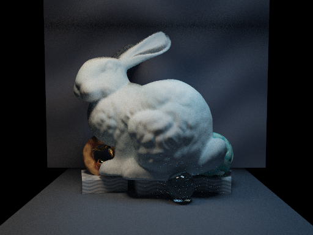

The Bunny's scale is 7.8 instead of the gallery's usual 3.5, while the plinths and neighboring exhibits keep their original dimensions. This mismatch makes the Bunny dominate the room and overlap the smaller displays. Moving the camera back fits it into the image, but does not correct the proportions. [Scene](scenes/bloopers/bunnyzilla.json).

### The Stanford Pancake

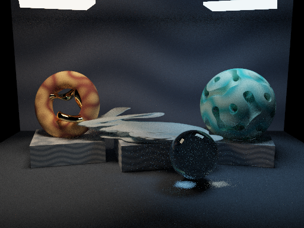

The scale values are `[4.8, 0.65, 3.5]`, so the vertical axis is compressed much more than the other two. The transform flattens the body and ears together, leaving a wide, thin Bunny on the plinth. The mesh still contains all 69,451 triangles; the distortion comes from the object transform. [Scene](scenes/bloopers/pancake_bunny.json).

### The gallery after closing

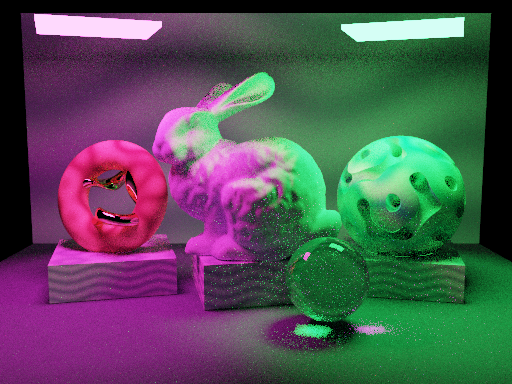

Both area lights have strongly saturated colors, and their emission is nearly nine times the normal setting. Magenta and green light dominate the surfaces and spread through indirect bounces, overwhelming the gallery's original material colors. The bright reflections on the metal and glass make the room look more like a nightclub than a museum. [Scene](scenes/bloopers/nightclub_bunny.json).

### Forgot my glasses

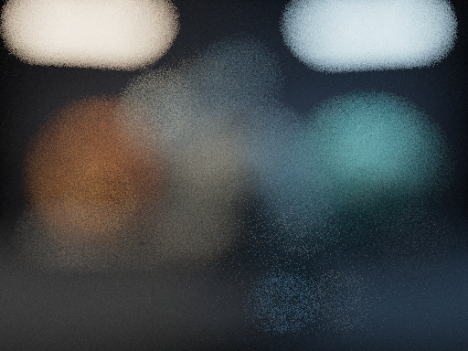

The focus distance is 4.0, placing the focal plane well in front of the exhibits, which are roughly eleven units from the camera. With an aperture radius of 0.45, the focus mismatch produces heavy blur across the Bunny and the rest of the gallery. Increasing the sample count reduces noise, but cannot bring an out-of-focus subject back into focus. [Scene](scenes/bloopers/forgot_my_glasses.json).

All four outtakes use the actual renderer and the same Bunny mesh and shading/BVH code as the gallery, with changes to scene transforms, lighting, or camera settings. Each is rendered at 512 × 384 and 256 spp.

## Scenes and schema

| Scene(s) | Purpose |
| --- | --- |
| [Bunny Observatory](scenes/bunny_observatory.json), [preview](scenes/bunny_observatory_preview.json) | Full mesh showcase and quick render |
| [Prismatic Orrery](scenes/prismatic_orrery.json) | Original mesh-free composition |
| [Analysis scenes](scenes/analysis/) | Feature switches, open/closed rooms, two mesh sizes, resolution sweep, thin silhouettes, convergence |
| [Blooper scenes](scenes/bloopers/) | Oversized/flattened Bunny, nightclub lighting, and misplaced focus |

Materials add `TYPE: "Glass"` (alias `"Refractive"`) and `IOR`; `"Specular"` means a perfect mirror. Diffuse patterns accept `TEXTURE: "Checker"` or `"Marble"`, `RGB2`, and `TEXTURE_SCALE`. `ROUGHNESS` does not produce a rough BSDF. Object types add `torus`, `woven_ring`, `gyroid`, and `mesh` (alias `obj`). Cameras add `APERTURE` (radius, default 0) and `FOCUS_DISTANCE` (forward-axis distance).

Example mesh object, `FILE` relative to the scene:

```json
{"TYPE":"mesh", "FILE":"../assets/models/stanford_bunny.obj", "MATERIAL":"ceramic",
 "TRANS":[0,1,0], "ROTAT":[0,0,0], "SCALE":[2,2,2]}
```

## Reproduce a measurement or profile

Use the same executable/scene and change only the intended flag:

```powershell
$renderer = '.\build\verify\bin\Release\cis565_path_tracer.exe'
& $renderer scenes/analysis/orrery.json --headless --sort off --iterations 36 --no-save --timings analysis/local/sort_off.csv
& $renderer scenes/analysis/orrery.json --headless --sort on --iterations 36 --no-save --timings analysis/local/sort_on.csv
& $renderer scenes/analysis/closed.json --headless --sort off --rr off --iterations 12 --no-save --stats analysis/local/closed_bounces.csv
& $renderer scenes/analysis/lighting_diffuse.json --headless --sort off --rr off --direct-light on --seed 10000 --iterations 512 --checkpoints 1,8,32,128 --output img/local/lighting
```

Repeat timing pairs five times, discard samples 1–4, average each run, and compare median run means. `--timings` records full-sample event time; `--stats` adds per-bounce intervals and survivors and should be used separately. `--depth N`, `--iterations N`, `--aperture R`, and `--seed N` override settings. Timing/statistics/checkpoints/no-save require headless mode. Output directories are created automatically. Ignored Python helpers remain in the local workspace but are not a dependency of the published project.

The GPU kernel stack uses Nsight Systems `profile --trace=cuda --sample=none --cpuctxsw=none`, followed by `stats --report cuda_gpu_kern_sum --format csv`. Totals were grouped by renderer stage, remaining Thrust/CUB kernels grouped together, and divided by 36 samples. [Nsight Systems analysis documentation](https://docs.nvidia.com/nsight-systems/AnalysisGuide/index.html).

For Nsight Compute, start with the **basic** metric set and a renderer kernel-name filter. Launch Capture Count counts matching **launches**, not unique kernel names: five launches can repeat functions and omit others. A short headless render with no capture-count limit is useful for seeing all kernel types. Collecting more metrics requires replay passes and can extend profiling considerably. Estimated speedup percentages are optimization estimates, not measured before/after speedups. [Nsight Compute profiling guide](https://docs.nvidia.com/nsight-compute/ProfilingGuide/index.html).

## Build changes and limitations

Relative to the starter, CMake uses C++17/CUDA17, native CUDA architecture selection, and separable compilation. Release adds CUDA `-lineinfo`/`-src-in-ptx`; Windows forwards `/Zc:preprocessor`. `src/mesh.h` joins the header list. Debug and RelWithDebInfo retain `-G`, so use **Release for performance measurements**. Bundled Windows dependencies produce an `LNK4098` runtime-library warning here; Release linked and completed the renders.

No new third-party code/library was introduced for OBJ loading, BVH construction/traversal, or analysis additions. Existing dependencies remain GLM, CUDA/Thrust, ImGui, GLFW, GLEW, stb, and nlohmann JSON from the framework. Texture-file loading, bump mapping, denoising, motion blur, subsurface scattering, rough specular BSDFs, restartable state, and scene-wide BVHs are not implemented or claimed.

## Model attribution and references

**Stanford Bunny:** Stanford Computer Graphics Laboratory; reconstructed by **Greg Turk and Marc Levoy**. Downloaded from the [Stanford 3D Scanning Repository](https://graphics.stanford.edu/data/3Dscanrep/) ([archive](https://graphics.stanford.edu/pub/3Dscanrep/bunny.tar.gz)). The educational/research data asks for source acknowledgment; consult the linked terms for other uses. Two reconstructed resolutions were converted PLY → OBJ, centered and uniformly normalized, with area-weighted smooth vertex normals. [Provenance/checksums](assets/models/stanford_bunny.source.json). The gallery composition, materials, procedural shapes, loader, and traversal are original additions.

Rendering concepts: [PBRT diffuse reflection](https://pbr-book.org/4ed/Reflection_Models/Diffuse_Reflection), [dielectric BSDFs](https://pbr-book.org/4ed/Reflection_Models/Dielectric_BSDF), [thin-lens camera](https://pbr-book.org/4ed/Cameras_and_Film/Projective_Camera_Models#TheThinLensModelandDepthofField), [area-light path tracing](https://pbr-book.org/4ed/Light_Transport_I_Surface_Reflection/A_Better_Path_Tracer), [Russian roulette](https://www.pbr-book.org/3ed-2018/Monte_Carlo_Integration/Russian_Roulette_and_Splitting), and [Paul Bourke's sampling notes](https://paulbourke.net/miscellaneous/raytracing/).
